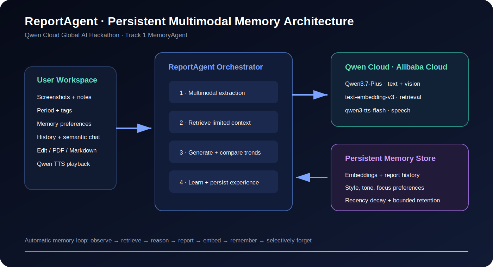

# ReportAgent

**Track 1: MemoryAgent — Qwen Cloud Global AI Hackathon**

AI-powered report generator with persistent memory. Upload screenshots and notes, and get structured reports that learn from your history.



## Features

- **AI Report Generation** — Upload screenshots + notes → structured report with summary, sections, data highlights, and next steps
- **Persistent Memory** — Remembers past reports, learns your preferences, and compares trends across periods
- **Selective Forgetting** — Configurable retention, bounded storage, and access-aware memory pruning
- **Semantic Search** — Embedding-based memory retrieval finds relevant past context automatically
- **Voice Playback** — TTS reading of generated reports
- **Report History** — Browse all past reports in the sidebar

## Architecture

```
┌─────────────┐     ┌──────────────────────┐     ┌─────────────────┐
│   Browser  │────▶│  Next.js (App)     │────▶│  Qwen Cloud AI  │
│  (React)   │     │  /api/generate     │     │  (DashScope)    │
│            │     │  /api/memories     │     │  qwen3.7-plus   │
│            │     │  /api/tts          │     │                 │
└─────────────┘     └───────┬──────────────┘     └─────────────────┘
                            │
                    ┌───────▼──────────────┐
                    │  Memory Store         │
                    │  (memories.json)      │
                    │  + Embedding Index    │
                    └──────────────────────┘
```

## Tech Stack

| Layer | Technology |
|-------|-----------|
| Frontend | React 18, Tailwind CSS |
| Backend | Next.js 14 (App Router) |
| AI | Qwen 3.7-Plus (DashScope), qwen-tts |
| Memory | JSON file store + OpenAI embeddings |
| Production Memory | Cloudflare Workers KV |
| Alibaba Cloud | Qwen Cloud APIs + Function Compute deployment spec |
| Container | Docker, docker-compose |
| Testing | Vitest, Testing Library |

## Setup

### Prerequisites

- Node.js 22+
- Docker (optional, for containerized deploy)
- Qwen Cloud API key (DashScope)

### Local Development

```bash
# Install dependencies
npm install

# Create .env file
cp .env.example .env
# Edit .env: add your DASHSCOPE_API_KEY

# Start dev server
npm run dev
```

Open [http://localhost:3000](http://localhost:3000).

### Testing

```bash
npm test          # Run once
npm run test:watch  # Watch mode
```

### Docker

```bash
docker compose up --build
```

### Deploy to Alibaba Cloud ECS

```bash
DASHSCOPE_API_KEY=sk-xxx ./scripts/deploy.sh <your-ecs-ip>
```

## Environment Variables

| Variable | Default | Description |
|----------|---------|-------------|
| `DASHSCOPE_API_KEY` | — | Qwen Cloud API key (required) |
| `OPENAI_BASE_URL` | `https://dashscope-intl.aliyuncs.com/compatible-mode/v1` | API endpoint |
| `OPENAI_MODEL` | `qwen3.7-plus` | Model name |

## MemoryAgent design

ReportAgent automatically stores each generated report with an embedding. For each new task it retrieves recent reports and semantically relevant reports, deduplicates them, and uses at most five memories in the Qwen context. User style, tone, and focus preferences persist across sessions. Memories outside the configured retention window are forgotten, and the store is bounded to 100 entries using recency and access frequency.

## Alibaba Cloud deployment proof

- Qwen Cloud integration: [`lib/qwen.ts`](lib/qwen.ts)
- Function Compute custom-container specification: [`deploy/alibaba-cloud/s.yaml`](deploy/alibaba-cloud/s.yaml)
- Deployment instructions: [`deploy/alibaba-cloud/README.md`](deploy/alibaba-cloud/README.md)

## Competition materials

- Devpost submission copy: [`docs/DEVPOST_SUBMISSION.md`](docs/DEVPOST_SUBMISSION.md)
- Demo narration and shot list: [`docs/DEMO_SCRIPT.md`](docs/DEMO_SCRIPT.md)
- Presentation deck: [`docs/ReportAgent_Hackathon_Deck.pptx`](docs/ReportAgent_Hackathon_Deck.pptx)
- Architecture diagram: [`public/architecture.svg`](public/architecture.svg)
- Open-source license: [`LICENSE`](LICENSE)

## Submission

Submitted for **Qwen Cloud Global AI Hackathon 2026** — Track 1: MemoryAgent.

- **Demo Video**: [link]
- **Devpost**: [link]
